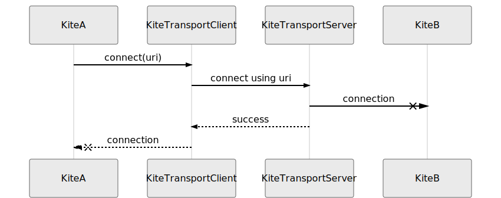
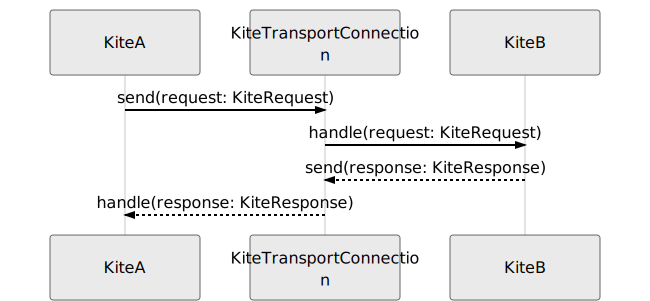

Kite Protocol
=============

**Kite Protocol** is a set of rules between **Kite** components in order for 2
different **Kite Apis** to make requests each other.

## General

**Kite Protocol** makes use of [dnode-protocol] to execute a **Kite Request**
from one **Kite Api** to another, and get a **Kite Response** back.

**Kite Protocol** defines the interaction between components of a Kite connection
of request/response cycle, including details about how this components of 2
different Kite Apis can connect to each other using **Kite Transform**
implementations.

## Components

In its simplest terms, **Kite** is not something more than a simple wrapper
around [dnode-protocol] which sets itself aside by allowing users to define
**Kite Transform** implementations to provide a transparent and extensible way
for connecting 2 different [dnode-protocol] instances running on different
processes (either local or remote depends on transform implementation).

### Kite Api

A **Kite Api** is a set of named functions that can be called sending a **Kite
Request** using a **Kite Transform** connection. Once the **Kite Response** is
ready for this request, it will be sent using the same connection.

A kite api method can be in 2 different forms:

```js
{
  [methodname]: (...args, done: Function) => void
}
```

or

```js
{
  [methodname]: (...args, done: Function, kiteInfo: Object) => void
}
```

- `done` is completion callback and it **MUST** be present right after the
  arguments of the method. It can be called with `done(error, result)`
- There can be 0 or more arguments before `done`.
- There will be only one argument after `done` callback, which is an object have
  metadata about the requester kite.

**Example**

```js
const api = new KiteApi({
  methods: {
    ping: (done) => done(null, 'pong')
  }
})
```

In order to call the `ping` method defined in this api, one should send the
following [dnode-protocol] request:

```js
{
  'method': 'ping',
  'arguments': [
    '[Function]', // a callback function
    { ...kiteInfo }
  ],
  'callbacks': [
    '0'
  ],
  'links': []
}
```

And this [dnode-protocol] request would send the following [dnode-protocol]
request as a response:

```js
{
  'method': 0, // some integer which denotes that this is a response. A convention in dnode-protocol itself.
  'arguments': [
    null, // error
    'pong' // result
  ],
  'callbacks': [],
  'links': []
}
```

### Kite Request & Kite Response

As can be seen above there is a convention for each response created by each request:

**KiteRequest:**

- A `KiteRequest` IS a valid `dnode-protocol` request.
- A `KiteRequest` IS a valid parseable JSON string. (as a part of [dnode-protocol])
- A `KiteRequest` SHOULD have a key named 'method' and it's value SHOULD be a `string`.
- A `KiteRequest` SHOULD at least have 2 arguments:
  - A `KiteRequest` SHOULD have requesting kite's info as its last argument.
  - A `KiteRequest` SHOULD have a response callback as its argument before the last.
- A `KiteRequest` SHOULD have at least a value indicating the place of its
  response callback. (as a part of [dnode-protocol])

**KiteResponse:**

- A `KiteResponse` IS a valid `dnode-protocol` request.
- A `KiteResponse` IS a valid parseable JSON string. (as a part of [dnode-protocol])
- A `KiteResponse` SHOULD have a key named 'method' and it's value SHOULD be an `integer`.
- A `KiteResponse` SHOULD exactly have 2 arguments in 2 different formats:
  1) First argument of a `KiteResponse` SHOULD be a valid `Error` object AND
     second argument of a `KiteResponse` SHOULD be `undefined`.
  2) First argument of a `KiteResponse` SHOULD be `null` AND second argument of
     a `KiteResponse` CAN be `any` JSON serializable value.

### Kite Transform

So far we only defined rules on how we are going to define a `KiteApi` and how
a `KiteRequest` should be structured in order for it to get a valid
`KiteResponse` back. What `kite` sets aside itself from [dnode-protocol] is
that it allows `KiteTransport` implementations to exist and correctly transfer
`KiteRequest`s and `KiteResponse`s.

**KiteTransport** itself consists of 2 different components:

- `KiteTransportServer`
- `KiteTransportClient`
- `KiteTransportConnection`

Any valid implementation of `KiteTransport` SHOULD have one implementation for
`KiteTransportServer` and SHOULD have one implementation for
`KiteTransportClient`, and the communication between server and client should
be done via a `KiteTransportConnection` implementation.

#### Kite Transport Server

- waits for `KiteTransportConnection`s from `KiteTransportClient`s.
- validates each request if they are valid `KiteRequest`s.
- forwards the request to `KiteApi` and waits for a valid `KiteResponse`.
- sends `KiteResponse` back to related `KiteTransportClient` using the connection.

#### Kite Transport Client

- creates a `KiteTransportConnection` to a `KiteTransportServer`.
- waits for a valid `KiteRequest` from attached `KiteApi`.
- sends `KiteRequest` to `KiteTransportServer`
- waits for a valid `KiteResponse` from `KiteTransportServer` for related `KiteRequest`.
- forwards the `KiteResponse` from `KiteTransportServer` to `KiteApi` back.

#### Kite Transport Summary

- A `KiteApi` (kite-a) gets attached to a `KiteTransportServer`.
- `KiteTransportServer` starts listening for `KiteTransportConnection`s from other `KiteTransportClient`s.
- Another `KiteApi` (kite-b) creates a `KiteTransportClient` to create a `KiteTransportConnection` to `KiteTransportServer`.
- Both kites will have a `KiteTransportConnection` if everything happens successfully.
- `kite-a` creates a `KiteRequest` and sends it to `kite-b` using created `KiteTransportConnection`.
- `kite-b` responds it with a `KiteResponse` using created `KiteTransportConnection`.

**Connection process**



**Request / Response Process:**



[dnode-protocol]: https://github.com/substack/dnode-protocol/blob/master/doc/protocol.markdown
